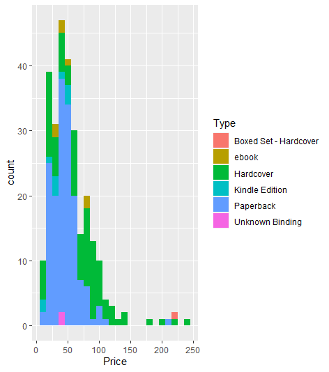
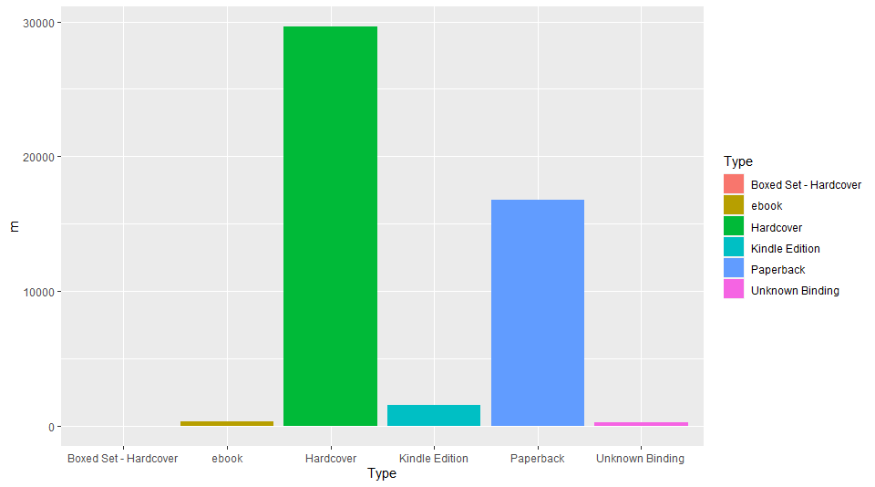

# R-Assignment 4

**Created by Name-Surname (ID: 63130500008)**

Choose Dataset:
1. Top 270 Computer Science / Programing Books (Data from Thomas Konstantin, [Kaggle](https://www.kaggle.com/thomaskonstantin/top-270-rated-computer-science-programing-books)) >> [Using CSV](https://raw.githubusercontent.com/safesit23/INT214-Statistics/main/datasets/prog_book.csv)


### Outlines
1. Explore the dataset
2. Learning function from Tidyverse
3. Transform data with dplyr and finding insight the data
4. Visualization with GGplot2

## Part 1: Explore the dataset

```
# Library
library(dplyr)
library(readr)
# Dataset
books <- read_csv("https://raw.githubusercontent.com/safesit23/INT214-Statistics/main/datasets/prog_book.csv")
```

#### Explore the dataset
```{R}
View(books)
glimpse(books)
```
result
```{R}
Rows: 271
Columns: 7
$ Rating          <dbl> 4.17, 4.01, 3.33, 3.97, 4.06, 3.84, 4.09, 4.15, ~
$ Reviews         <dbl> 3829, 1406, 0, 1658, 1325, 117, 5938, 1817, 2093~
$ Book_title      <chr> "The Elements of Style", "The Information: A His~
$ Description     <chr> "This style manual offers practical advice on im~
$ Number_Of_Pages <dbl> 105, 527, 50, 393, 305, 288, 256, 368, 259, 128,~
$ Type            <chr> "Hardcover", "Hardcover", "Kindle Edition", "Har~
$ Price           <dbl> 9.323529, 11.000000, 11.267647, 12.873529, 13.16~
```
#introduce() จะอธิบายรายละเอียดต่างๆของชุดข้อมูล เช่น มีข้อมูลสูญหายกี่แถว มีตัวแปรที่เป็นตัวเลขแบบต่อเนื่องและไม่ต่อเนื่องมีกี่ตัวแปร มีข้อมูลที่สมบูรณ์กี่แถว รวมถึงหน่วยความจำที่ใช้เก็บข้อมูลเป็นเท่าไหร่
```{R}
books %>% introduce();
```
result
```{R}
rows columns discrete_columns continuous_columns all_missing_columns
  <int>   <int>            <int>              <int>               <int>
1   271       7                3                  4                   0
# ... with 4 more variables: total_missing_values <int>,
#   complete_rows <int>, total_observations <int>, memory_usage <dbl>
```


#  Part 2: Learning function from Tidyverse
```{R}
# Library
install.packages("tidyverse")
library(forcats) 
```

#### 1) ทำการสร้างคอลัมน์ใหม่ขึ้นมาจากคอลัมน์ Type โดยตารางที่แสดงใหม่จะให้แสดงเพียงตัวอักษรตัวแรกเท่านั้น
ตัวอย่าง การใช้ fuction fct_c
```{R}
library(forcats)
fa  <-  factor ( "a" ) 
fb  <-  factor ( "b" ) 
fab  <-  factor ( c ( "a" ,  "b" ))

c ( fa ,  fb ,  fab ) 
fct_c ( fa ,  fb ,  fab )

#คุณยังสามารถผ่านรายการปัจจัยด้วย!!! 
fs  <-  list ( fa ,  fb ,  fab ) 
fct_c ( !!! fs ) 
```
Result:
```{R}
[1] 1 1 1 2
[1] a b a b
Levels: a b
[1] a b a b
Levels: a b
```
Explain
- จะใช้ Function ``` fct_c ()``` จาก packageinstall.packages("tidyverse")ที่มาจาก library(forcats)
เพื่อใช้ในการนี่เป็นวิธีที่มีประโยชน์ในการรวม factor จากหลายแหล่งเข้าด้วยกัน ซึ่งจริงๆ แล้วควรมีระดับเดียวกันแต่ไม่มี


# Part 3: Transform data with dplyr and finding insight the data

1.	#### 1) 10อันดับแรกหนังสือที่มีริวิวมากสุดและมีราคาเท่าไหร่บ้าง
```{R}
books %>% select(Reviews,Book_title,Price) %>%
  arrange(desc(Reviews)) %>% head(n = 10L);
``` 
Result:
```{R}
   Reviews Book_title                                                Price
     <dbl> <chr>                                                     <dbl>
 1    5938 Start with Why: How Great Leaders Inspire Everyone to Ta~ 14.2 
 2    3829 The Elements of Style                                      9.32
 3    2629 The Phoenix Project: A Novel About IT, DevOps, and Helpi~ 24.3 
 4    2290 The Goal: A Process of Ongoing Improvement                37.1 
 5    2093 Weapons of Math Destruction: How Big Data Increases Ineq~ 14.5 
 6    2092 The Innovators: How a Group of Hackers, Geniuses and Gee~ 17.2 
 7    1817 Algorithms to Live By: The Computer Science of Human Dec~ 14.4 
 8    1658 Ghost in the Wires: My Adventures as the World's Most Wa~ 12.9 
 9    1406 The Information: A History, a Theory, a Flood             11   
10    1325 How Google Works     13.2
``` 
Explain
- ใช้คำสั่ง ```select()``` เพื่อที่จะเลือกคอลัมน์ที่ต้องการแสดง จากนั้นใช้คำสั่ง ```arrange()``` เพื่อจะได้เรียกข้อมูลและใช้ ```desc()``` เพื่อที่จะทำให้ข้อมูลเรียงจากมากไปน้อย แล้วใช้คำสั่ง ```head()``` เพื่อที่จะบอกว่าเราต้องการที่จะแสดงข้อมูลตามที่กำหนด 


#### 2) 10 อันดับหนังสือที่มีจำนวนหน้ามากสุดมีกี่หน้าและมีราคาเท่าไหร่บ้าง
```{R}
books %>% select(Number_Of_Pages,Book_title,Price) %>%
 arrange(desc(Number_Of_Pages)) %>% head(n = 10L);
``` 
Result:
```{R}
     Number_Of_Pages Book_title                                        Price
             <dbl> <chr>                                             <dbl>
 1            3168 The Art of Computer Programming, Volumes 1-4a Bo~ 220. 
 2            1506 The Linux Programming Interface: A Linux and Uni~  46.4
 3            1235 Numerical Recipes: The Art of Scientific Computi~ 176. 
 4            1214 Learning Python                                    67.9
 5            1200 Beginning Java 2                                   36.6
 6            1180 Introduction to Algorithms                         92.3
 7            1142 Database System Concepts                           85.6
 8            1136 Modern Operating Systems, 4th Edition             103. 
 9            1136 The C++ Standard Library: A Tutorial and Referen~ 113. 
10            1132 Artificial Intelligence: A Modern Approach        116. 
``` 
Explain
- ใช้คำสั่ง ```select()``` เพื่อที่จะเลือกคอลัมน์ที่ต้องการแสดง จากนั้นใช้คำสั่ง ```arrange()``` เพื่อจะได้เรียกข้อมูลและใช้ ```desc()``` เพื่อที่จะทำให้ข้อมูลเรียงจากมากไปน้อย แล้วใช้คำสั่ง ```head()``` เพื่อที่จะบอกว่าเราต้องการที่จะแสดงข้อมูลตามที่กำหนด 


1.	#### 3) 10 อันดับแรกของหนังสือที่มีเรทติ้งมากสุดและมีราคาเท่าไหร่บ้าง
```{R}
books %>% select(Rating,Book_title,Price) %>%
arrange(desc(Rating)) %>% head(n = 10L);
``` 
Result:
```{R}
   Rating Book_title                                                 Price
    <dbl> <chr>                                                      <dbl>
 1   5    Your First App: Node.js                                     25.9
 2   4.77 The Art of Computer Programming, Volumes 1-4a Boxed Set    220. 
 3   4.72 Designing Data-Intensive Applications: The Big Ideas Behi~  45.6
 4   4.67 Build Web Applications with Java: Learn every aspect to b~  42.3
 5   4.67 Fluent Python: Clear, Concise, and Effective Programming    64.1
 6   4.62 ZX Spectrum Games Code Club: Twenty fun games to code and~  14.6
 7   4.62 The Linux Programming Interface: A Linux and Unix System ~  46.4
 8   4.58 CLR via C# (Developer Reference)                            66.3
 9   4.54 The Elements of Computing Systems: Building a Modern Comp~  41.3
10   4.54 Practical Object Oriented Design in Ruby                    50.1
``` 
Explain
- ใช้คำสั่ง ```select()``` เพื่อที่จะเลือกคอลัมน์ที่ต้องการแสดง จากนั้นใช้คำสั่ง ```arrange()``` เพื่อจะได้เรียกข้อมูลและใช้ ```desc()``` เพื่อที่จะทำให้ข้อมูลเรียงจากมากไปน้อย แล้วใช้คำสั่ง ```head()``` เพื่อที่จะบอกว่าเราต้องการที่จะแสดงข้อมูลตามที่กำหนด 

1.	#### 4) 10 อันดับแรกของหนังสือราคาแพงที่สุดคือเล่มไหนและราคาเท่าไหร่บ้าง
```{R}
books %>% select(Price,Description,Book_title) %>%
arrange(desc(Price)) %>% head(n = 10L)
``` 
Result:
```{R}
Price Description                       Book_title                     
   <dbl> <chr>                             <chr>                          
 1  236. "Designed to help individual pro~ A Discipline for Software Engi~
 2  220. "Knuth's classic work has been w~ The Art of Computer Programmin~
 3  220. "\"The bible of all fundamental ~ The Art of Computer Programmin~
 4  212. "Continuing in the eighth editio~ An Introduction to Database Sy~
 5  203. "Dave Eberly's 3D Game Engine De~ 3D Game Engine Architecture: E~
 6  176. "Co-authored by four leading sci~ Numerical Recipes: The Art of ~
 7  143. "The journey continues with this~ Game Programming Gems 3        
 8  139. "Uncover the secrets of the game~ Game Programming Gems 4        
 9  127. "This introduction to compilers ~ Compilers: Principles, Techniq~
10  119. "Welcome to the sixth volume of ~ Game Programming Gems 6        
``` 
Explain
- ใช้คำสั่ง ```select()``` เพื่อที่จะเลือกคอลัมน์ที่ต้องการแสดง จากนั้นใช้คำสั่ง ```arrange()``` เพื่อจะได้เรียกข้อมูลและใช้ ```desc()``` เพื่อที่จะทำให้ข้อมูลเรียงจากมากไปน้อย แล้วใช้คำสั่ง ```head()``` เพื่อที่จะบอกว่าเราต้องการที่จะแสดงข้อมูลตามที่กำหนด 


#### 5) 10 อันดับแรกของหนังสือที่แพงที่สุด มีประเภทไหนบ้าง
```{R}
books %>% select(Type,Book_title,Price) %>%
arrange(desc(Price)) %>% head(n = 10L);
``` 
Result:
```{R}
  Type                  Book_title                                  Price
   <chr>                 <chr>                                       <dbl>
 1 Hardcover             A Discipline for Software Engineering        236.
 2 Boxed Set - Hardcover The Art of Computer Programming, Volumes 1~  220.
 3 Hardcover             The Art of Computer Programming, Volumes 1~  220.
 4 Paperback             An Introduction to Database Systems          212.
 5 Hardcover             3D Game Engine Architecture: Engineering R~  203.
 6 Hardcover             Numerical Recipes: The Art of Scientific C~  176.
 7 Hardcover             Game Programming Gems 3                      143.
 8 Hardcover             Game Programming Gems 4                      139.
 9 Hardcover             Compilers: Principles, Techniques, and Too~  127.
10 Hardcover             Game Programming Gems 6                      119.
``` 
Explain
- ใช้คำสั่ง ```select()``` เพื่อที่จะเลือกคอลัมน์ที่ต้องการแสดง จากนั้นใช้คำสั่ง ```arrange()``` เพื่อจะได้เรียกข้อมูลและใช้ ```desc()``` เพื่อที่จะทำให้ข้อมูลเรียงจากมากไปน้อย แล้วใช้คำสั่ง ```head()``` เพื่อที่จะบอกว่าเราต้องการที่จะแสดงข้อมูลตามที่กำหนด 

#### 6) หนังสือแต่ละประเภทมีกี่เล่มและราคาแพงที่สุดคือราคาเท่าไหร่
```{R}
books %>% group_by(Type) %>% 
 summarise(count =n(),
 Price_max = max(Price)); 
``` 
Result:
```{R}
  Type                  count Price_max
  <chr>                 <int>     <dbl>
1 Boxed Set - Hardcover     1     220. 
2 ebook                     7      83.2
3 Hardcover                95     236. 
4 Kindle Edition           10      51.5
5 Paperback               156     212. 
6 Unknown Binding           2      38.3
``` 
Explain
- ใช้คำสั่ง ``` group_by ()```เพื่อจัดกลุ่มของข้อมูล จากนั้นใช้ ``` summarise ()``` เพื่อจะได้หาจำนวนข้อมูล และหาค่ามากที่สุดของ Price


#### 7) หนังสือที่มี Rating  มากกว่า 4.5 คะแนน และมีรีวิว
```{R}
books %>% 
    filter(Rating >4.5 & Reviews !=0)
``` 
Result:
```{R}
 Rating Reviews Book_title     Description    Number_Of_Pages Type  Price
   <dbl>   <dbl> <chr>          <chr>                    <dbl> <chr> <dbl>
1   4.54      52 The Elements ~ "This book is~             325 Hard~  41.3
2   4.67       1 Build Web App~ "This book is~             372 Pape~  42.3
3   4.72     362 Designing Dat~ "Want to know~             616 Pape~  45.6
4   4.62      28 The Linux Pro~ "The Linux Pr~            1506 Hard~  46.4
5   4.54     171 Practical Obj~ "The Complete~             247 Pape~  50.1
6   4.67      78 Fluent Python~ "Python's sim~             792 Pape~  64.1
7   4.58      58 CLR via C# (D~ "Dig deep and~             863 Pape~  66.3
8   4.77       4 The Art of Co~ "\"The bible ~            3168 Hard~ 220. 
``` 
Explain
- ใช้คำสั่ง ```filter()``` ใช้กรองข้อมูลที่มี Rating มากกว่า 4.5 คะแนน  และต้องมีการ Review หนังสือด้วย (review 	ไม่เป็น 0)

## Part 4: Visualization with GGplot2
### 1.) Graph show relation between height and mass

#แสดงกราฟ histogram ของจำนวนหนังสือแต่ละประเภทตามราคา
```{R}
books %>% 
  ggplot(aes(x = Price, group = Type, fill = Type)) +
  geom_histogram(binwidth = 10)
``` 
<p align="center">
  
</p>

<p align="center">รูปที่ 1 กราฟ histogram ของจำนวนหนังสือแต่ละประเภทตามราคา
</p>

#กราฟ bar หนังสือแต่ละประเภทมีค่าเฉลี่ยรีวิว
```{R}
books %>% 
  group_by(Type, Reviews) %>% 
  summarize(m = mean(Reviews)) %>% 
  ggplot(aes(x = Type, y = m, group = Type, fill = Type)) +
  geom_bar(stat = "identity")
```
<p align="center">
  
</p>

<p align="center">รูปที่ 2 กราฟ bar หนังสือแต่ละประเภทมีค่าเฉลี่ยรีวิว
</p>