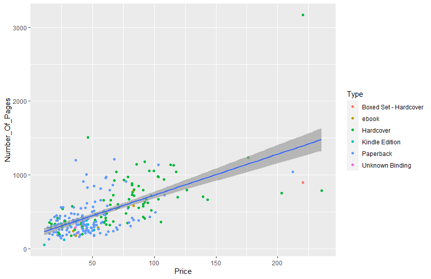
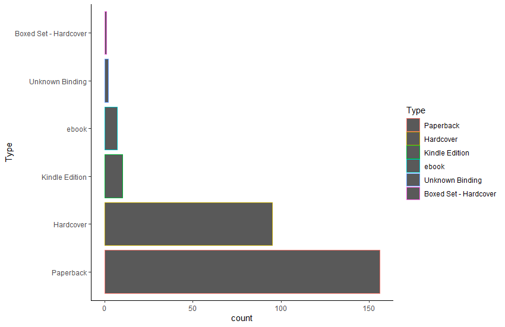

# 🍱 R-Assignment 4

**Created by Nutwara Boonyangkongkaew (ID: 63130500035)**

Choose Dataset:
Top 270 Computer Science / Programing Books (Data from Thomas Konstantin, [Kaggle](https://www.kaggle.com/thomaskonstantin/top-270-rated-computer-science-programing-books)) >> [Using CSV](https://raw.githubusercontent.com/safesit23/INT214-Statistics/main/datasets/prog_book.csv)

### 🍚 Outlines
1. Explore the dataset
2. Transform data with dplyr and finding insight the data
3. Visualization with GGplot2
4. Using command from tidyverse
5. Creating Interaction Dashboard with BI Tools

## 🍜 Part 1: Explore the dataset

```
# Install the packages
install.packages("dplyr", "readr", "ggplot2", "DataExplorer", "stringr", "tidyverse", "forcats")  

# Activate the packages
library(dplyr) 
library(readr)  
library(ggplot2) 
library(DataExplorer) 
library(stringr)
library(tidyverse)                          
library(forcats)

# Load dataset
comsci <- read_csv("https://raw.githubusercontent.com/safesit23/INT214-Statistics/main/datasets/prog_book.csv")
```


In this dataset has a list of 270 books in the field of computer science and programming related topics.<br>
with rating, reviews, book title, description, number of pages, type, and price that dataset has 271 rows 7 columns.<br>

The list of books was constructed using many popular websites <br>
which provide information on book ratings of all the book in those websites the 270 most popular were selected.<br>


| No. | Variable              | Data Type   |
|:---:|-------------------|--------------|
|1.   |Rating| double|
|2.   |Reviews |number|
|3.   |Book_title| character|
|4.   |Description |character|
|5.   |Number_Of_Pages |double|
|6.   |Type |character|
|7.   |Price |double|


```
# see dataset overview 'comsci'     
glimpse(comsci)     # preview the dataset
summary(comsci)     # result summaries of various model fitting functions  
introduce(comsci)   # explain the details of the dataset 
```
Result:
```
Rows: 271
Columns: 7
$ Rating          <dbl> 4.17, 4.01, 3.33, 3.97, 4.06, 3.84, 4.09, 4.15, 3.87, 4.62, 4.03, 3.78, 3.73, 3.87, 3.87, 3.95, 3.8~
$ Reviews         <dbl> 3829, 1406, 0, 1658, 1325, 117, 5938, 1817, 2093, 0, 160, 481, 33, 1255, 593, 417, 80, 279, 370, 20~
$ Book_title      <chr> "The Elements of Style", "The Information: A History, a Theory, a Flood", "Responsive Web Design Ov~
$ Description     <chr> "This style manual offers practical advice on improving writing skills. Throughout, the emphasis is~
$ Number_Of_Pages <dbl> 105, 527, 50, 393, 305, 288, 256, 368, 259, 128, 352, 352, 200, 328, 240, 288, 392, 304, 336, 542, ~
$ Type            <chr> "Hardcover", "Hardcover", "Kindle Edition", "Hardcover", "Kindle Edition", "Paperback", "Hardcover"~
$ Price           <dbl> 9.323529, 11.000000, 11.267647, 12.873529, 13.164706, 14.188235, 14.232353, 14.364706, 14.502941, 1~

     Rating         Reviews        Book_title        Description        Number_Of_Pages      Type               Price        
 Min.   :3.000   Min.   :   0.0   Length:271         Length:271         Min.   :  50.0   Length:271         Min.   :  9.324  
 1st Qu.:3.915   1st Qu.:   5.5   Class :character   Class :character   1st Qu.: 289.0   Class :character   1st Qu.: 30.751  
 Median :4.100   Median :  35.0   Mode  :character   Mode  :character   Median : 384.0   Mode  :character   Median : 46.318  
 Mean   :4.067   Mean   : 185.6                                         Mean   : 475.1                      Mean   : 54.542  
 3rd Qu.:4.250   3rd Qu.: 116.5                                         3rd Qu.: 572.5                      3rd Qu.: 67.854  
 Max.   :5.000   Max.   :5938.0                                         Max.   :3168.0                      Max.   :235.650  

# A tibble: 1 x 9
   rows columns discrete_columns continuous_columns all_missing_columns total_missing_values complete_rows total_observations memory_usage
  <int>   <int>            <int>              <int>               <int>                <int>         <int>              <int>        <dbl>
1   271       7                3                  4                   0                    0           271               1897       163072
```


### 🌟 Explore dataset with graphs in RStudio.

#### ⛅ Dataset details
```
comsci %>% plot_intro()
```
<p align="center">
  
</p>

<p align="center">รูปที่ 1 คำอธิบายชุดข้อมูล
</p>

จากกราฟเห็นได้ว่า
- variable ข้อมูลแบบไม่ต่อเนื่อง --> 43%  
- variable ข้อมูลแบบต่อเนื่อง --> 57%
- column ทั้งหมดมี missing values --> 0%
- จำนวน row / ข้อมูลสมบูรณ์ --> 100% 
- missing observation value ขาดหายไป --> 0%

แสดงว่า ไม่มีการสูญหายของชุดข้อมูล / ชุดข้อมูลครบถ้วนสมบูรณ์

### ✈️ Check the distribution and density of the data.
#### 🛩️ For numeric variables

```
comsci %>% plot_density()
comsci %>% plot_histogram()  
```
<p align="center">

</p>

<p align="center">
รูปที่ 2 กราฟแสดงการกระจายของข้อมูลด้วย density plot
</p>

<p align="center">

</p>

<p align="center">
รูปที่ 3 กราฟแสดงการกระจายของข้อมูลด้วย histogram plot
</p>

#### 🛩️ For character variables 
only retrieve columns >= 50 categories.
```
comsci %>% plot_bar() 
```

<p align="center">

</p>

<p align="center">
รูปที่ 4 กราฟแท่งแสดงปริมาณของข้อมูลเชิงคุณภาพ
</p>


### 🌨️ Finding Relationships

```
comsci %>% plot_correlation() 
```

<p align="center">

</p>

<p align="center">
รูปที่ 5 กราฟแสดงความสัมพันธ์ของชุดข้อมูล
</p>

Non-numeric group data cannot be correlated.

--> use one-hot encoding.

--> making it possible to see all the relationships of various variable.


## 🥡 Part 2: Transform data with dplyr and finding insight the data

1. หาราคาเฉลี่ยของหนังสือแต่ละประเภท 🎃


```
comsci %>% group_by(Type) %>% select(Price) %>% summarise(avg = mean(Price, na.rm = TRUE))
```


Result:
```
# A tibble: 6 x 2
  Type                    avg
  <chr>                 <dbl>
1 Boxed Set - Hardcover 220. 
2 ebook                  51.4
3 Hardcover              70.1
4 Kindle Edition         32.4
5 Paperback              45.8
6 Unknown Binding        37.2
```
จากโจทย์ได้ใช้ command ดังต่อไปนี้ <br>

`group_by` --> นำ data frame และ variables (<i>Type</i>) มาจัดกลุ่ม <br>

`select()` --> เลือกใช้ variable ที่ชื่อว่า <i>Price</i>                   <br>

`summarise()` --> ทำการสรุปค่าเฉลี่ยของ <i>Price</i>               <br>

ได้ใจความว่า หาราคาเฉลี่ยแล้วทำการจัดกลุ่มด้วยประเภทของหนังสือ โดยแสดงข้อมูลของประเภทและราคาเฉลี่ยของหนังสือออกมา


2. หนังสือเล่มไหนบ้างที่มีตั้งแต่ 1500 หน้าขึ้นไป 🎄


```
comsci %>% select(Book_title, Number_Of_Pages)%>% filter(Number_Of_Pages >= 1500);
```


Result:
```
# A tibble: 2 x 2
  Book_title                                                                    Number_Of_Pages
  <chr>                                                                                   <dbl>
1 The Linux Programming Interface: A Linux and Unix System Programming Handbook            1506
2 The Art of Computer Programming, Volumes 1-4a Boxed Set                                  3168
```

จากโจทย์ได้ใช้ command ดังต่อไปนี้  <br>

`select()` --> เลือกใช้ variable ที่ชื่อว่า <i>Book_title</i>, <i>Number_Of_Pages</i>             <br>

`filter()` --> ระบุเงื่อนไขไว้ว่า จำนวนหน้าของหนังสือ <i>Number_Of_Pages</i> มีมากกว่าหรือเท่ากับ 1500    <br>

ได้ใจความว่า หาหนังสือที่มีจำนวนหน้าไม่ต่ำกว่า 1500 หน้า โดยแสดงข้อมูลชื่อและจำนวนหน้าของหนังสือออกมา


3. หนังสือประเภทใดที่มีจำนวนมากที่สุด 🎏


```
comsci %>% count(Type, sort = TRUE) %>% head(n = 1L);
```


Result:
```
# A tibble: 1 x 2
  Type          n
  <chr>     <int>
1 Paperback   156
```

จากโจทย์ได้ใช้ command ดังต่อไปนี้  <br>

`count()` --> นับจำนวนข้อมูลตามกลุ่มตัวแปรที่ระบุไว้ (<i>Type</i>) <br>

`head()` --> แสดงผลออกมาตามจำนวนที่ระบุไว้    <br>

ได้ใจความว่า หาว่าหนังสือประเภทใดมีจำนวนมากที่สุด โดยระบุมาเพียงประเภทเดียว

4. บอกรายละเอียดของหนังสือที่มี rating มากที่สุด 🎎


```
comsci %>% filter(Rating == max(Rating));
```


Result:
```
# A tibble: 1 x 7
  Rating Reviews Book_title              Description                                            Number_Of_Pages Type  Price
   <dbl>   <dbl> <chr>                   <chr>                                                            <dbl> <chr> <dbl>
1      5       0 Your First App: Node.js "A tutorial for real-world application development us~             317 ebook  25.9
```

จากโจทย์ได้ใช้ command ดังต่อไปนี้  <br>

`filter()` --> ระบุเงื่อนไขไว้ว่า หา <i>Rating</i> ที่มีมากที่สุด    <br>

ได้ใจความว่า หารายละเอียดทั้งหมดของหนังสือที่มี rating มากที่สุุด  


5. เรียงจำนวนการดูของหนังสือประเภท e-book ในลำดับจากน้อยไปมาก 🎈

```
comsci %>%  filter(Type=="ebook") %>% dplyr::select(Book_title,Type,Reviews) %>% arrange(Reviews)
```


Result:
```
# A tibble: 7 x 3
  Book_title                                      Type  Reviews
  <chr>                                           <chr>   <dbl>
1 Your First App: Node.js                         ebook       0
2 Practical Foundations for Programming Languages ebook       3
3 From Mathematics to Generic Programming         ebook      18
4 Algorithms Unlocked                             ebook      33
5 Effective Programming: More Than Writing Code   ebook      57
6 Deep Learning                                   ebook      88
7 Learn You a Haskell for Great Good!             ebook     161
```

จากโจทย์ได้ใช้ command ดังต่อไปนี้  <br>

`filter()` --> ระบุเงื่อนไขไว้ว่า หา <i>Type</i> ที่ชื่อว่า "ebook"    <br>

`select()` --> เลือกใช้ variable ที่ชื่อว่า <i>Book_title</i>, <i>Type</i> และ <i>Reviews</i>  <br>

`arrange()` --> เปลี่ยนลำดับ row ของ <i>Reviews</i> โดยเรียงจากน้อยไปหามาก    <br>

ได้ใจความว่า หาหนังสือประเภท e-book โดยแสดงข้อมูลชื่อ, ประเภทและจำนวนการดูของหนังสือซึ่งเรียงลำดับจำนวนการดูจากน้อยไปมาก


6. เปลี่ยนชื่อ variable จาก Description เป็น Explanation 🎊


```
rename(comsci, Explanation = Description)   # rename column 
```


Result:
```
# A tibble: 271 x 7
   Rating Reviews Book_title                       Explanation                                Number_Of_Pages Type    Price
    <dbl>   <dbl> <chr>                            <chr>                                                <dbl> <chr>   <dbl>
 1   4.17    3829 The Elements of Style            "This style manual offers practical advic~             105 Hardco~  9.32
 2   4.01    1406 The Information: A History, a T~ "James Gleick, the author of the best sel~             527 Hardco~ 11   
 3   3.33       0 Responsive Web Design Overview ~ "In Responsive Web Design Overview For Be~              50 Kindle~ 11.3 
 4   3.97    1658 Ghost in the Wires: My Adventur~ "If they were a hall of fame or shame for~             393 Hardco~ 12.9 
 5   4.06    1325 How Google Works                 "Both Eric Schmidt and Jonathan Rosenberg~             305 Kindle~ 13.2 
 6   3.84     117 The Meme Machine                 "What is a meme? First coined by Richard ~             288 Paperb~ 14.2 
 7   4.09    5938 Start with Why: How Great Leade~ "Why do you do what you do?\n\nWhy are so~             256 Hardco~ 14.2 
 8   4.15    1817 Algorithms to Live By: The Comp~ "A fascinating exploration of how insight~             368 Hardco~ 14.4 
 9   3.87    2093 Weapons of Math Destruction: Ho~ "A former Wall Street quant sounds an ala~             259 Hardco~ 14.5 
10   4.62       0 ZX Spectrum Games Code Club: Tw~ "This book is ideal for ZX Spectrum fans ~             128 Paperb~ 14.6 
# ... with 261 more rows
```

จากโจทย์ได้ใช้ command ดังต่อไปนี้  <br>

`rename()` --> เปลี่ยนชื่อ variable ของ <i>Description</i> เป็น <i>Explanation</i>    <br>

โดยมี syntax ว่า new_name = old_name;   <br>

ได้ใจความว่า ให้เปลี่ยนชื่อ column จาก "Description" เป็น "Explanation"


## 🍧 Part 3: Visualization with GGplot2
### 1.) Graph show relation between price and number of page. 💎
```
scat_plot1 <- comsci %>% filter(pages<=500) %>% ggplot(aes(x=Price,y=Number_Of_Pages))+
  geom_point(aes(color=Type))

scat_plot1+geom_smooth(method="lm")
```
Result:

<p align="center">
  
</p>

<p align="center">รูปที่ 6 Scatter Plot (Positive Correlation)
</p>


จากกราฟเห็นได้ว่า มีความสัมพันธ์เชิงเส้น(เชิงบวก)ระหว่างสองตัวแปร  <br>
เมื่อตัวแปร x (<i>Price</i>) เพิ่ม, ตัวแปร y (<i>Number_Of_Page</i>) ก็จะเพิ่มขึ้นด้วย (x เป็นสัดส่วนโดยตรงกับ y)  <br>

แสดงว่า ราคายิ่งสูง จำนวนหน้าของหนังสือก็มีมากขึ้นเรื่อย ๆ <br>

<b>เพิ่มเติม</b> บทความเกี่ยวกับนิยาม Scatter Plot : [ที่นี่](https://ichi.pro/th/scatter-plot-kheruxng-mux-sahrab-sthiti-cheing-phrrnna-5185213788052)<br>

### 2.) Graph show relation between price and rating. 👑
```
ggplot(data = comsci,
       mapping = aes(x = Price, y = Rating, color = Type)) +
  geom_line() +                   # add a line graph style
  geom_point() +                  # add a graph style as a point
  facet_wrap(vars(Type)) +        # grouped into category
  theme_bw()                      # make a grid
```
Result:

<p align="center">
  
</p>

<p align="center">รูปที่ 7 สร้างกราฟจาก GGplot2 
</p>


กราฟได้แบ่งเป็นหมวดหมู่ แยกเป็นสีตามประเภทของหนังสือ  <br>
ทั้งนี้ยังแสดงความสัมพันธ์ระหว่าง Rating และ Price ของหนังสือ  <br>

ซึ่งได้มาจากคำถามที่ว่า Rating ของหนังสือแต่ละประเภทมีความสัมพันธ์กับราคาของหนังสืออย่างไร ?  <br>
คำตอบที่ได้คือ ไม่มีความตายตัว   <br>
โดย หนังสือที่มีราคาถูกกว่าก็สามารถมี Rating สูงกว่า หนังสือที่มีราคาแพงกว่าได้  <br>
และหนังสือที่มีราคาถูกกว่าก็สามารถมี Rating ต่ำกว่า หนังสือที่มีราคาแพงกว่าได้  <br>
แล้วหนังสือที่ราคาใกล้เคียงกันก็มี Rating ที่ต่างกันหรือใกล้เคียงกันได้  <br>

ทั้งนี้การกระจายและความหนาแน่นของเส้นกราฟสามารถประเมินปริมาณความมากน้อยของหนังสือแต่ละประเภทได้  <br>
บ่งบอกได้ว่า Paperback มีจำนวนมากที่สุด รองลงมาคือ Hardcover, Kindle Edition, ebook, Unknown Binding และ Boxed Set - Hardcover ตามลำดับ  <br>


## 🍡 Part 4: Using command from tidyverse (e.g. forcats, stringr)
ตัวอย่างนี้จะใช้ `forcats` package โดยใช้ชุดข้อมูลก่อนหน้านี้ (implement to dataset 'comsci')

```
comsci %>%
  mutate(Type = fct_infreq(Type)) %>%
  ggplot(aes(x = Type)) +    
  geom_bar(aes(color=Type)) +            # classified by the specified column = 'Type'
  coord_flip()                           # swap the x-axis and the y-axis
```

Result:

<p align="center">
  
</p>

<p align="center">รูปที่ 8 สร้างกราฟจาก forcats package 
</p>


ตัวอย่างนี้จะใช้ `stringr` package โดยใช้ข้อมูลที่สมมุติขึ้น (not implement to dataset 'comsci')
```
A <- "INT214 Statistics for IT"
str_to_lower(A)       # converts the string into lower case
str_to_upper(A)       # converts the string into upper case 
str_length(A)         # checks the length of the string

str_c("I", "LOVE", "214")    # combine multiple strings

x <- c("gigabyte", "elegent", "together","Anyway") 
str_sub(x,0,1)               # select only the specified
```

Result:
```
[1] "int214 statistics for it"
[1] "INT214 STATISTICS FOR IT"
[1] 24

[1] "ILOVE214"

[1] "g" "e" "t" "A"
```


## 🍙 Part 5: Creating Interaction Dashboard with BI Tools

[Power BI: Top 270 Computer Science / Programing Books](https://app.powerbi.com/view?r=eyJrIjoiODM0MDU0ZmItMGEyMS00NWJlLWE3NDMtMzY4NGU3OGNhOThmIiwidCI6IjZmNDQzMmRjLTIwZDItNDQxZC1iMWRiLWFjMzM4MGJhNjMzZCIsImMiOjEwfQ%3D%3D&pageName=ReportSection)
