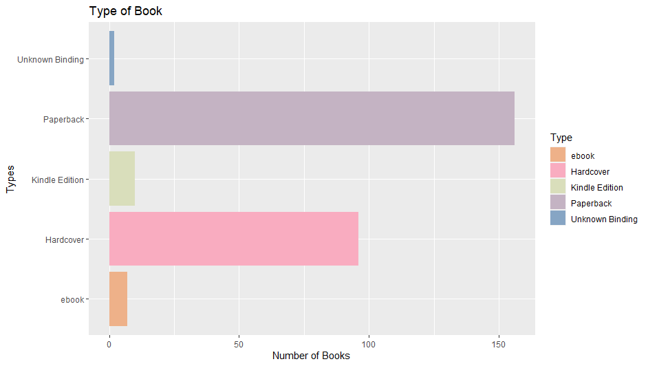
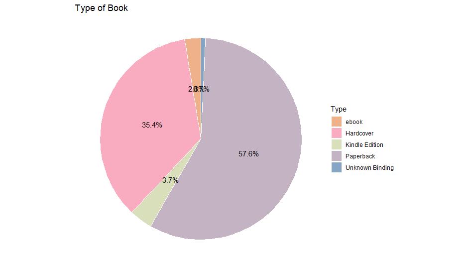
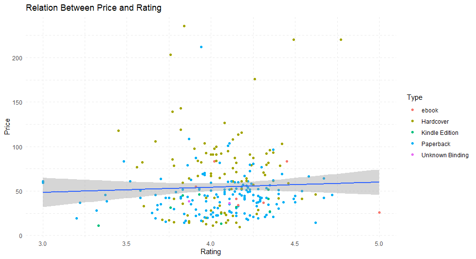
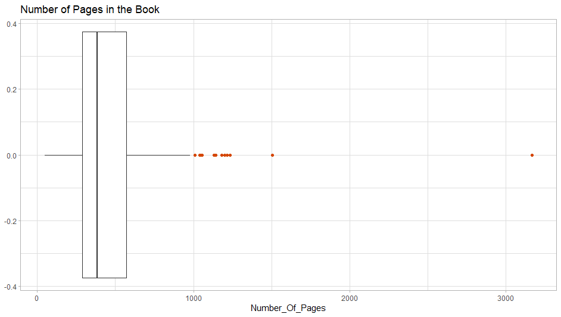

# R-Assignment 4

**Created by Panalee Palasri (ID: 63130500075)**

🚩 Choose Dataset:
- Top 270 Computer Science / Programing Books (Data from Thomas Konstantin)
    - [Data in Kaggle](https://www.kaggle.com/thomaskonstantin/top-270-rated-computer-science-programing-books)
    - [Data in CSV (in my github repository)](data_book.csv)

### Outlines
1. Explore the dataset
2. Learning function from Tidyverse
3. Transform data with dplyr and finding insight the data
4. Visualization with GGplot2

## 📌 Part 1: Explore the dataset

💡 In this dataset has a list of 270 books in the field of computer science and programming related topics. The information has been compiled from popular websites. 

**Import library and dataset**
```R
# Library
library(readr)      # read .csv file
library(dplyr)      # use %>% function
library(ggplot2)    # Plotting graph
library(stringr)    # Changing of data format
library(forcats)    # Provide a suite of tools that solve common
library(DescTools)  # For better use in exploring data and more function
library(scales)     # use find percent

# Dataset
Books <- read_csv("https://raw.githubusercontent.com/sit-2021-int214/027-Quickest-Electric-Cars/main/assignment/Homework04/HW04_63130500087/data.csv")
View(Books)
```

**Explore dataset**
```R
glimpse(Books)
```
```
Rows: 271
Columns: 7
$ Rating          <dbl> 4.17, 4.01, 3.33, 3.97, 4.06, 3.84, 4.09, 4.15, 3.87, 4.62, 4.03, 3.78, 3.73, 3.87, 3.87, 3.95, 3.85, 3.94, 3.75, 4.10, 4.22, 3.71, 4.21, 4.28, 3.20, 3.67, 3.97~
$ Reviews         <dbl> 3829, 1406, 0, 1658, 1325, 117, 5938, 1817, 2093, 0, 160, 481, 33, 1255, 593, 417, 80, 279, 370, 2092, 27, 676, 16, 1268, 0, 19, 491, 48, 1, 1, 16, 39, 356, 86,~
$ Book_title      <chr> "The Elements of Style", "The Information: A History, a Theory, a Flood", "Responsive Web Design Overview For Beginners", "Ghost in the Wires: My Adventures as ~
$ Description     <chr> "This style manual offers practical advice on improving writing skills. Throughout, the emphasis is on promoting a plain English style. This little book can hel~
$ Number_Of_Pages <dbl> 105, 527, 50, 393, 305, 288, 256, 368, 259, 128, 352, 352, 200, 328, 240, 288, 392, 304, 336, 542, 192, 242, 224, 412, 318, 432, 336, 320, 288, 320, 224, 384, 4~
$ Type            <chr> "Hardcover", "Hardcover", "Kindle Edition", "Hardcover", "Kindle Edition", "Paperback", "Hardcover", "Hardcover", "Hardcover", "Paperback", "Hardcover", "Hardco~
$ Price           <dbl> 9.323529, 11.000000, 11.267647, 12.873529, 13.164706, 14.188235, 14.232353, 14.364706, 14.502941, 14.641176, 15.229412, 15.229412, 15.326471, 15.682353, 15.8852~
```

💡 Inside that dataset, contains information about the book, number of pages in the book, the book types, the book descriptions, and the book prices. This dataset is an easy-to-understand and relatively complete dataset with a total of 270 rows and 7 columns:

| No. | Column Name | Column Details | Data Type |
| ---- | ---- | ---- | ---- |
|1|Rating|Rating of the book|numeric|
|2|Reviews|Number of reviews on this book|numeric|
|3|Book_title|Name of the book|character| 
|4|Description|Description of the book|character| 
|5|Number_Of_Pages|Number of pages in the book|numeric|
|6|Type|The type of book (E.g. Hardcover, Kindle Edition, Paperback, etc.)|character| 
|7|Price|Average price of the book in USD|numeric| 

**Find the NA of each column.** There is no NA in the dataset.
```R
is.na(topbooks$Rating) %>% sum()
is.na(topbooks$Reviews) %>% sum()
is.na(topbooks$Book_title) %>% sum()
is.na(topbooks$Description) %>% sum()
is.na(topbooks$Number_Of_Pages) %>% sum()
is.na(topbooks$Type) %>% sum()
is.na(topbooks$Price) %>% sum()
```

💡 But this dataset has some minor modifications to the column type, the term "Boxed Set" should be omitted from "Boxed Set - Hardcover".

**Cleaning data column "Type" the word "Box set".**
```R
Books$Type <- Books$Type %>% str_remove("Boxed Set -") %>% str_trim()
View(Books)
```
💡 See the cleaned data at [data_book_cleaned.csv](data_book_cleaned.csv)

----

## 📌 Part 2: Learning function from Tidyverse

The Tidyverse library contains the following packages:
 1. `ggplot2`
 2. `tribble`
 3. `tidyr`
 4. `readr`
 5. `purr`
 6. `dplyr`
 7. `stringr`
 8. `forcats`

### 📂 Example function and syntax

📐 **Package `stringr`**
- Function `str_remove()` : Remove matched patterns in a string.
```R
Books$Type %>% str_remove("Boxed Set -")
```
- Function `str_count()` : Count the number of matches in a string.
```R
str_count(Books$Description, "[aeiou]")
```
- Function `parse_number()` : Parse numbers, flexibly.
- Function `col_skip()` : Skip a column.

📐 **Package `readr`**
 - Function `read_csv()` : Read a .csv files.
```R
Books <- read_csv("https://raw.githubusercontent.com/sit-2021-int214/027-Quickest-Electric-Cars/main/assignment/Homework04/HW04_63130500087/data.csv")
```
 - Function `cols_condense()` : Examine the column specifications for a data frame.
```R
cols_condense(Books)
```
 - Function `spec()` : View data types with reader formats.
```R
spec(Books)
```
- Function `parse_number()` : Parse numbers, flexibly.
- Function `col_skip()` : Skip a column.

📐 **Package `forcats`**
- Function `as_factor()` : Convert input to a factor.
- Function `fct_count()` : Count entries in a factor.
- Function `fct_infreq()` : Sort data by frequency.
- Function `fct_shuffle()` : Randomly permute factor levels.

📐 **Package `dplyr`**
- Function `select()` : Select/rename variables by name.
```R
Books %>% select(Rating,Book_title,Price)
```
- Function `glimpse()` : Get a glimpse of your data.
```R
glimpse(Books)  
```
- Function `count()` : Count the number of occurences.
```R
Books %>% count()
Books %>% count(Type == "ebook")
```
- Function `filter()` : Return rows with matching conditions.
```R
Books %>% filter(Number_Of_Pages <= 200)
```
- Function `arrange()` : Arrange rows by variables.
```R
Books %>% arrange(Sales)
Books %>% arrange(desc(Sales)) # Use desc() to sort a variable in descending order.
```
- Function `distinct()` : Select distinct/unique rows.
```R
Books %>% select(Type) %>% distinct()
```
- Function `summarise()` : Reduces multiple values down to a single value.
```R
Books %>% summarise(Books)
```
- Function `group_by()` : Group by one or more variables.
```R
Books %>% group_by(Type)
```
- Function `tally()` : Count/tally observations by group.
```R
Books %>% group_by(Type) %>% tally(sort = TRUE)
```
- Function `group_size()` : Calculate group sizes. 
```R
group_size(Books)
```
- Function `as.factor()` : Changing character into factor. 
```R
as.factor(Books$Price)
```
- Function `tbl()` : Create a table from a data source. 
- Function `mutate()` : Add new variables. 
- Function `explain()` : Explain details of a tbl. 
- Function `ident()` : Flag a character vector as SQL identifiers.
- Function `pull()` : Pull out a single variable.

📐 **Package `ggplot2`**
- Function `coord_flip()` : Cartesian coordinates with x and y flipped.
```R
ggplot(Books,aes(x = Type)) + geom_bar() + coord_flip()
```
- Function `coord_polar()` : Polar coordinates.
- Function `calc_element()` : Calculate the element properties, by inheriting properties from its parents.
- Function `theme_get()` : PGet, set, and modify the active theme.

----

## 📌 Part 3: Transform data with dplyr and finding insight the data

### 📚 1. What are the top 3 books with the highest ratings?
```R
Books %>% select(Book_title,Rating) %>% arrange(desc(Rating)) %>% head(n = 3L)
```
Result:
```
Book_title                                                         Rating
  <chr>                                                               <dbl>
1 Your First App: Node.js                                              5   
2 The Art of Computer Programming, Volumes 1-4a Boxed Set              4.77
3 Designing Data-Intensive Applications: The Big Ideas Behind Relia~   4.72
```
Explain
- select : Select specific column (Book_title,Rating).
- arrange : Use desc to sort data from highest to lowest.
- head : Used to display the first 3 rows of data.

### 📚 2. Which book has less than or equal to 200 pages?
```R
Books %>% select(Book_title,Number_Of_Pages) %>% filter(Number_Of_Pages < 200)
```
Result:

```
Book_title                                               Number_Of_Pages
   <chr>                                                              <dbl>
 1 The Elements of Style                                                105
 2 Responsive Web Design Overview For Beginners                          50
 3 ZX Spectrum Games Code Club: Twenty fun games to code a~             128
 4 Debugging: The 9 Indispensable Rules for Finding Even t~             192
 5 What Is Life? with Mind and Matter and Autobiographical~             184
 6 JavaScript: The Good Parts                                           153
 7 The Pattern on the Stone: The Simple Ideas that Make Co~             176
 8 The Connection Machine                                               190
 9 Agile Retrospectives: Making Good Teams Great                        170
10 Scrum and XP from the Trenches                                       140
# ... with 12 more rows
```
Explain
- select : Select specific column (Book_title,Number_Of_Pages)
- filter : Find information on books with less than 200 pages.

----

### 📚 3. What books are not reviewed at all and how many?
```R
Books %>% select(Book_title,Reviews) %>% filter(Reviews == 0)
```
Result:
```
Book_title                                                       Reviews
   <chr>                                                              <dbl>
 1 Responsive Web Design Overview For Beginners                           0
 2 ZX Spectrum Games Code Club: Twenty fun games to code and learn        0
 3 Game Programming Golden Rules                                          0
 4 Beginners Guide On PHP Programming: Quick And Easy Guide To Lea~       0
 5 Python Programming Books Set: Python Programming for Beginners ~       0
 6 Your First App: Node.js                                                0
 7 Python Programming For Beginners: Quick And Easy Guide For Pyth~       0
 8 Building an FPS Game with Unity                                        0
 9 Advanced Game Programming: A Gamedev.Net Collection                    0
10 Basic Proof Theory                                                     0
# ... with 12 more rows
```
Explain
- select : Select specific column (Book_title,Reviews).
- filter : Find out about books that have not been reviewed at all.

----

### 📚 4. How many books are reviewed in all 270 books?
```R
SumReviews <- Books %>% count(Reviews)
sum(SumReviews)
```
Result:
```
[1] 47030
```
Explain
- count : Count the total number of reviews.
- sum : Total number of reviews.

### 📚 5. How many e-books are there?
```R
Books %>% filter(Type == "ebook") %>% group_by(Type) %>% tally(sort = TRUE)
```
Result:
```
Type      n
  <chr> <int>
1 ebook     7
```
Explain
- filter : Find an e-book type book.
- group_by : grouping of book types
- tally : Count observations by group.

### 📚 6. Which book doesn't know the type of book and how much per book?
```R
Books %>% select(Book_title,Type,Price) %>% filter(Type == "Unknown Binding")
```
Result:
```
Book_title                                                   Type           Price
  <chr>                                                        <chr>          <dbl>
1 How to Think Like a Computer Scientist: Learning with Python Unknown Bindi~  36.1
2 Learn Python The Hard Way                                    Unknown Bindi~  38.3
```
Explain
- select : Select specific column (Book_title,Type,Price).
- filter : Find a book that doesn't know the type of book.

### 📚 **7. What types of books are there and How many books are there in each type of book?**
```R
Books %>% group_by(Type) %>% count()
```
Result:
```
  Type                n
  <chr>           <int>
1 ebook               7
2 Hardcover          96
3 Kindle Edition     10
4 Paperback         156
5 Unknown Binding     2
```
Explain
- group_by : Group the types of books.
- count : Count the number of books of each type.

### 📚 **8. What is the average price for each type of book?**
```R
Books %>% group_by(Type) %>% select(Price) %>% summarise(avg = mean(Price, na.rm = TRUE)) 
```
Result:
```
  Type              avg
  <chr>           <dbl>
1 ebook            51.4
2 Hardcover        71.7
3 Kindle Edition   32.4
4 Paperback        45.8
5 Unknown Binding  37.2
```
Explain
- group_by : Group the types of books.
- select : Select specific column (Price).
- summarise : Find the average of the price by ignoring the NA data.

### 📚 **9. Which book and in what genre has a rating of more than 4.50?**
```R
Books %>% select(Rating,Book_title,Type) %>% filter(Rating > 4.50)
```
Result:
```
   Rating Book_title                                                                                               Type     
    <dbl> <chr>                                                                                                    <chr>    
 1   4.62 ZX Spectrum Games Code Club: Twenty fun games to code and learn                                          Paperback
 2   5    Your First App: Node.js                                                                                  ebook    
 3   4.54 The Elements of Computing Systems: Building a Modern Computer from First Principles                      Hardcover
 4   4.67 Build Web Applications with Java: Learn every aspect to build web applications from scratch              Paperback
 5   4.72 Designing Data-Intensive Applications: The Big Ideas Behind Reliable, Scalable, and Maintainable Systems Paperback
 6   4.62 The Linux Programming Interface: A Linux and Unix System Programming Handbook                            Hardcover
 7   4.54 Practical Object Oriented Design in Ruby                                                                 Paperback
 8   4.67 Fluent Python: Clear, Concise, and Effective Programming                                                 Paperback
 9   4.58 CLR via C# (Developer Reference)                                                                         Paperback
10   4.77 The Art of Computer Programming, Volumes 1-4a Boxed Set                                                  Hardcover
```
Explain
- select : Select specific column (Rating,Book_title,Type).
- filter : Find a book with a rating of more than 4.50.

----

## 📌 Part 4: Visualization with GGplot2

### 1.) Graph show type of book
```R
# Bar Chart
ggplot(Books,aes(x = Type, fill = Type)) + geom_bar() + ggtitle("Type of Book")
type_plot <- ggplot(Books,aes(x = Type, fill = Type)) + geom_bar() + ggtitle("Type of Book") + coord_flip() + 
             xlab("Types") + ylab("Number of Books") + 
             scale_fill_manual(values = c("#eeb189", "#f9acc0", 
                                          "#d9debb", "#c4b3c3", "#86a5c4" ))
type_plot
```
Result:



```R
# Pie Chart
group_type <- data.frame(table(Books$Type))
group_type <- group_type %>% rename("Type" = Var1,"count" = Freq)

group_type %>% ggplot(aes(x = "",y = count, fill = Type)) + 
               geom_bar(stat ="identity", width = 1, color = "white") +
               coord_polar("y", start = 0)+
               theme_void() +
               geom_text(aes(label = percent(count/sum(count))),
               position = position_stack(vjust = 0.5), size = 4, color = "black") + 
               ggtitle("Type of Book") +
               scale_fill_manual(values = c("#eeb189", "#f9acc0", 
                                            "#d9debb", "#c4b3c3", "#86a5c4" ))
```
Result:



- You will see the bar chart graph by ggplot2. Doing :
  - create graph, adding point
  - add title
  - add theme and decoration
- There are 5 types of books in total and the most popular book type is paperback.

### 2.) Graph show relation between price and rating
```R
## Scatter Plot
Books %>% ggplot(aes(x = Rating,y = Price)) + geom_point()
ratingPrice_plot <- Books %>% ggplot(aes(x = Rating,y = Price)) + 
                    geom_point(aes(color=Type)) + ggtitle("Relation Between Price and Rating")
ratingPrice_plot
ratingPrice_plot + geom_smooth()
ratingPrice_plot + geom_smooth(method="lm") + theme_minimal() + 
                   theme(panel.grid = element_line(linetype = "dashed"))
```
Result:



Explain :

- You will see the scatter plot graph by ggplot2. Doing :
  - create graph, adding point
  - add title
  - add theme and decoration
- You can see that the data is scattered on the graph. Most of the information is at the bottom in the middle.
- Book prices have no relation to ratings.

### 3.) Graph show Rating of the book
```R
## Box Plot
rating_plot <- Books %>% ggplot(aes(x = Number_Of_Pages)) + geom_boxplot(outlier.colour = "#d54700") + 
               ggtitle("Number of Pages in the Book") + theme_light() 
rating_plot
```
Result:



Explain :

- You will see the box plot graph by ggplot2. Doing :
  - create graph, adding point
  - add title
  - add theme and decoration
- The data has a lot of variance. The average number of pages in a book is about 400 pages.
- There are 11 outliers above the upper limit.

----

## 📌 Part B: [Dashboard in Power BI](https://app.powerbi.com/view?r=eyJrIjoiMGVhNWQwNGYtYzc3OS00YmIyLThjOGYtNmY0MGQ2YzJmOTg1IiwidCI6IjZmNDQzMmRjLTIwZDItNDQxZC1iMWRiLWFjMzM4MGJhNjMzZCIsImMiOjEwfQ%3D%3D)