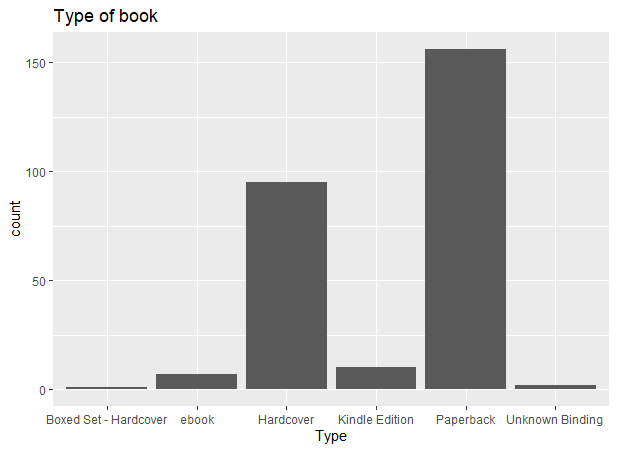
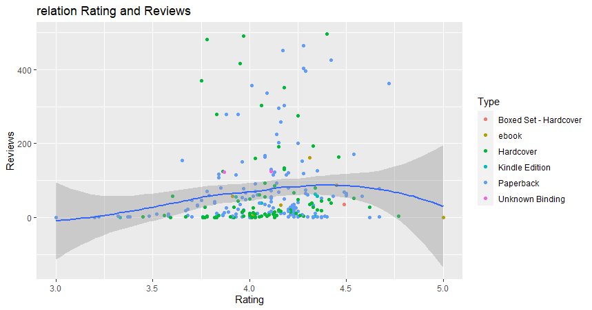

# R-Assignment 4

Created by __CHINCHUTHA THANASUPHAWIMON__ (ID: 63130500010)

## ♨️ Choose Dataset:
1. Top 270 Computer Science / Programing Books (Data from Thomas Konstantin, [Kaggle](https://www.kaggle.com/thomaskonstantin/top-270-rated-computer-science-programing-books)) >> [Using CSV](https://raw.githubusercontent.com/safesit23/INT214-Statistics/main/datasets/prog_book.csv)

### Outlines
1. Explore the dataset
2. Learning function from Tidyverse
3. Transform data with dplyr and finding insight the data
4. Visualization with GGplot2

---
<br>

## 🚪 Part 1: Explore the dataset

```
# Library
library(readr)
library(dplyr)
library(stringr)
library(ggplot2)

# dataset
book <- read_csv("https://raw.githubusercontent.com/safesit23/INT214-Statistics/main/datasets/prog_book.csv")

# viewdataset
glimpse(book)
```

📌 In this dataset holds a list of 270 books in the field of computer science and programming related topics. Inside that dataset, you will find general information about the book including the number of pages in the book, the book types, the book descriptions, and the book prices. Inside that dataset has 270 rows 7 column
| column | Data Type | Description |
| ---- | ---- | ---- |
| Rating | numeric | เรตติ้งของหนังสือว่ามีความนิยมมากแค่ไหน
| Reviews | numeric | แสดงจำนวนบทวิจารณ์ที่พบในหนังสือเล่มนี้
| Book_title | character | ชื่อของหนังสือ
| Description | character | คำอธิบายของหนังสือ
| Number_Of_Pages | numeric | จำนวนหน้าของหนังสือเล่มนั้นๆ
| Type | character | ประเภทของหนังสือ เช่น หนังสือปกอ่อน หนังสือปกแข็ง
| Price | numeric  | ราคาของหนังสือเล่มนั้นๆ

```
Rows: 271
Columns: 7
$ Rating          <dbl> 4.17, 4.01, 3.33, 3.97, 4.06, 3.84, 4.09, 4.15, 3.87, 4.62, 4.03, 3.78, 3.7~
$ Reviews         <dbl> 3829, 1406, 0, 1658, 1325, 117, 5938, 1817, 2093, 0, 160, 481, 33, 1255, 59~
$ Book_title      <chr> "The Elements of Style", "The Information: A History, a Theory, a Flood", "~
$ Description     <chr> "This style manual offers practical advice on improving writing skills. Thr~
$ Number_Of_Pages <dbl> 105, 527, 50, 393, 305, 288, 256, 368, 259, 128, 352, 352, 200, 328, 240, 2~
$ Type            <chr> "Hardcover", "Hardcover", "Kindle Edition", "Hardcover", "Kindle Edition", ~
$ Price           <dbl> 9.323529, 11.000000, 11.267647, 12.873529, 13.164706, 14.188235, 14.232353,~
```
### 💡 สำรวจข้อมูลเบื้องต้น
```
summary(book)
```

Result
```
     Rating          Reviews           Book_title          Description      Number_Of_Pages         Type                 Price   
 Min.   :3.000    Min.   :   0.0    Length:271          Length:271          Min.   :  50.0      Length:271          Min.   :  9.324  
 1st Qu.:3.915    1st Qu.:   5.5    Class :character    Class :character    1st Qu.: 289.0      Class :character    1st Qu.: 30.751  
 Median :4.100    Median :  35.0    Mode  :character    Mode  :character    Median : 384.0      Mode  :character    Median : 46.318  
 Mean   :4.067    Mean   : 185.6                                            Mean   : 475.1                          Mean   : 54.542  
 3rd Qu.:4.250    3rd Qu.: 116.5                                            3rd Qu.: 572.5                          3rd Qu.: 67.854 
 Max.   :5.000    Max.   :5938.0                                            Max.   :3168.0                          Max.   :235.650  
```

---
<br>

## 🚪 Part 2: Learning function from Tidyverse

- Function `arrange()` from package [dplyr](https://dplyr.tidyverse.org/reference/arrange.html)). It using for select columns

```
book %>% arrange(Rating)
```
Explain 
- arrange() เป็น function ที่ใช้ในการเรียงข้อมูลจากน้อยไปมาก หรือ มากไปน้อย 
- desc คือ เรียงจากมากไปน้อย 
- แต่ถ้าเรียงจากน้อยไปมากก็ไม่จำเป็นต้องใส่เงื่อนไขอะไร เพราะ default จะเป็นค่าที่เรียงจากน้อยไปมากอยู่แล้ว

---
<br>

## 🚪 Part 3: Transform data with dplyr and finding insight the data
<br>

⚔️ 1.) แสดงประเภทของหนังสือว่ามีอะไรบ้างและแต่ละประเภทมีจำนวนเท่าไหร่  

```
book %>% group_by(Type) %>% count()
```

Result

```
 Type                      n
  <chr>                 <int>
1 Boxed Set - Hardcover     1
2 ebook                     7
3 Hardcover                95
4 Kindle Edition           10
5 Paperback               156
6 Unknown Binding           2
```

Explain 

- group_by จัดกลุ่มของประเภทหนังสือว่ามีอะไรบ้าง
- count ใช้นับจำนวนของหนังสือแต่ละประเภทว่ามีทั้งหมดกี่จำนวน

<br>
<br>

⚔️ 2.) หนังสือเรื่องอะไรบ้างที่มีราคามากกว่า 100 ขึ้นไป

```
book %>% select(Book_title,Price) %>% filter((Price) > 100)
```

Result

```
  Book_title                                                Price
   <chr>                                                    <dbl>
 1 Computer Architecture: A Quantitative Approach            101.
 2 Computer Systems: A Programmer's Perspective              103.
 3 Modern Operating Systems                                  103.
 4 Modern Operating Systems, 4th Edition                     103.
 5 Structured Computer Organization                          104.
 6 Game Engine Gems 1                                        106.
 7 Concepts, Techniques, and Models of Computer Programming  108.
 8 File Structures: An Object-Oriented Approach with C++     108.
 9 The C++ Standard Library: A Tutorial and Reference        113.
10 Artificial Intelligence: A Modern Approach                116.
# ... with 11 more rows
```

Explain 
- select เลือกข้อมูลเฉพาะ column (Book_title,Price)
- filter ใช้ใส่เงื่อนไขที่ราคาต้องมากกว่า 100
<br>
<br>

⚔️ 3.) 3 อันดับหนังสือเล่มไหนที่มีจำนวนหน้าเยอะที่สุด  

```
book %>% select(Book_title,Number_Of_Pages) %>% arrange(desc(Number_Of_Pages)) %>% head(n = 3L)
```

Result

```
Book_title                                                                    Number_Of_Pages
  <chr>                                                                                   <dbl>
1 The Art of Computer Programming, Volumes 1-4a Boxed Set                                  3168
2 The Linux Programming Interface: A Linux and Unix System Programming Handbook            1506
3 Numerical Recipes: The Art of Scientific Computing                                       1235
```

Explain 
- select เลือกข้อมูลเฉพาะ column (Book_title,Number_Of_Pages)
- arrange ในที่นี้ใช้ desc เพื่อใช้เรียงข้อมูลจำนวนหน้าของหนังสือจากมากไปน้อยเพื่อจะได้ง่ายต่อการนำไปคำนวณต่อ
- head ใช้แสดงข้อมูล 3 แถวแรก
<br>
<br>

⚔️ 4.) แสดงหนังสือที่ไม่มีคน review เลยและบอกราคาของหนังสือเล่มนั้นๆ

```
book %>% select(Book_title,Reviews,Price) %>% filter(Reviews==0)
```
Result

```
   Book_title                                                                           Reviews Price
   <chr>                                                                                  <dbl> <dbl>
 1 Responsive Web Design Overview For Beginners                                               0  11.3
 2 ZX Spectrum Games Code Club: Twenty fun games to code and learn                            0  14.6
 3 Game Programming Golden Rules                                                              0  19.2
 4 Beginners Guide On PHP Programming: Quick And Easy Guide To Learn PHP With My-SQL          0  23.2
 5 Python Programming Books Set: Python Programming for Beginners & Complete Guide for~       0  23.9
 6 Your First App: Node.js                                                                    0  25.9
 7 Python Programming For Beginners: Quick And Easy Guide For Python Programmers              0  29.0
 8 Building an FPS Game with Unity                                                            0  50.7
 9 Advanced Game Programming: A Gamedev.Net Collection                                        0  59.1
10 Basic Proof Theory                                                                         0  59.5
# ... with 12 more rows
```

Explain 
- select เลือกข้อมูลเฉพาะ column (Book_title,Reviews,Price)
- filter ใช้หาข้อมูล column Reviews ที่เท่ากับ 0
<br>
<br>

⚔️ 5.) หนังสือเรื่องไหนที่มีจำนวนรีวิวเยอะที่สุด

```
max_view <- book %>% group_by(Book_title) %>% summarise(Review = max(Reviews))
max_view %>% select(Book_title,Review) %>% filter(Review == max(max_view$Review))
```

Result

```
  Book_title                                                        Review
  <chr>                                                              <dbl>
1 Start with Why: How Great Leaders Inspire Everyone to Take Action   5938
```

Explain 
- group_by จัดกลุ่มของชื่อหนังสือ
- summarise ใช้หาค่า max ของ column reviews และนำข้อมูลทั้ง2อย่างไปเก็บที่ table max_view 
- select เลือกข้อมูลเฉพาะ column (Book_title,Review) จาก table max_view 
- filter ใช้หาค่า review ที่มากที่สุดใน table max_view
<br>
<br>

⚔️ 6.) แสดงหนังสือที่ได้เรตติ้งมากที่สุด 5 อันดับแรก

```
book %>% select(Book_title,Rating) %>% arrange(desc(Rating)) %>% head(n = 5L)
```

Result

```
  Book_title                                                                                   Rating
  <chr>                                                                                         <dbl>
1 Your First App: Node.js                                                                        5   
2 The Art of Computer Programming, Volumes 1-4a Boxed Set                                        4.77
3 Designing Data-Intensive Applications: The Big Ideas Behind Reliable, Scalable, and Maintai~   4.72
4 Build Web Applications with Java: Learn every aspect to build web applications from scratch    4.67
5 Fluent Python: Clear, Concise, and Effective Programming                                       4.67
```

Explain 
- select เลือกข้อมูลเฉพาะ column (Book_title,Rating)
- arrange ในที่นี้ใช้ desc เพื่อใช้เรียงข้อมูลจำนวนเรตติ้งที่มากที่สุด
- head ใช้แสดงข้อมูล 5 แถวแรก

---
<br>

## 🚪 Part 4: Visualization with GGplot2
### 1.) Graph show type of book
```
type_plot <- ggplot(book,aes(x=Type))+ geom_bar() + ggtitle("Type of book") 
type_plot
```
Result



Explain 
- กราฟนี้อธิบายเกี่ยวกับประเภทหนังสือว่าแต่ละประเภทมีทั้งหมดกี่เรื่อง
<br>

### 2.) Graph show relation Reviews < 500
```
review_plot <-book %>% 
  filter(Reviews <= 500 ) %>% 
  ggplot(aes(x=Rating,y=Reviews))
  + geom_point(aes(color=Type)) 
  + ggtitle("relation Rating and Reviews")
  + geom_smooth()
review_plot 
```
Result



Explain 
- กราฟนี้อธิบายเกี่ยวกับความสัมพันธ์ของ column Reviews และ Rating โดยจะหาข้อมูลหนังสือที่มีคน Reviews น้อยกว่า 500 คน ว่าการที่มีคนรีวิวน้อยกว่า 500 จะมีผลต่อเรตติ้งมากน้อยเพียงใด

